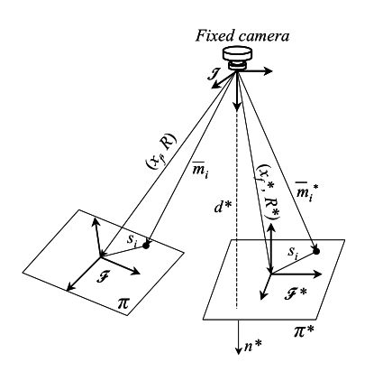

# Identification of a Moving Object's Velocity with a Fixed Camera

## Abstract
> In this paper, a continuous estimator strategy is utilized to asymptotically identify the six degree-of-freedom velocity of a moving object using a single fixed camera. The design of the estimator is facilitated by the fusion of homography-based techniques with Lyapunov design methods. Similar to the stereo vision paradigm, the proposed estimator utilizes different views of the object from a single camera to calculate 3D information from 2D images. In contrast to some of the previous work in this area, no explicit model is used to describe the movement of the object; rather, the estimator is constructed based on bounds on the object’s velocity, acceleration, and jerk.

本文提出了一种连续估计策略，用来在使用单目固定相机的情况下，渐进识别移动物体六个自由度上的速度。这种估计器的设计融合了基于单应性的技术（homography-based techniques）以及李雅普诺夫设计方法（Lyapunov design methods）。与立体视觉的模式相似，这种估计器利用单目相机对物体不同角度的二维图像，来计算三维信息。与本领域之前的一些工作不同的是，估计时没有物体运动的显式模型，而是基于物体运动的速度、加速度以及加速度的导数来构建估计器。

## 1 Introduction
> Often in an engineering application, one is tempted to use a camera to determine the velocity of a moving object. However, as stated in [8], the use of a camera requires one to interpret the motion of a 3-dimensional (3D) object through 2D images provided by the camera. That is, the primary problem is 3D information is compressed or nonlinearly transformed into 2D information; hence, techniques or methods must be developed to obtain 3D information despite the fact that only 2D information is available. 

工程应用上常常需要使用一个照相机来得到一个运动物体的速度。然而正如在[8]中所提到的那样，要做到这样，首先需要从相机提供的二维图像中描述三维物体的运动情况。也就是说，基本问题就是从三维信息到二维信息的转换是有压缩或者说是非线性的；因此，我们需要研究一种在只能获得二维信息的情况下，重建三维信息的技术或者说是方法。

> To address the identification of the object’s velocity (i.e., the motion parameters), many researchers have developed various approaches. For example, if a model for the object’s motion is known, an observer can be used to estimate the object’s velocity [10]. In [20], a window position predictor for object tracking was utilized. In [12], an observer for estimating the object velocity was utilized; however, a description of the object’s kinematics must be known. In [9], the problem of identifying the motion and shape parameters of a planar object undergoing Riccati motion was examined in great detail. In [13], an autoregressive discretetime model is used to predict the location of features of a moving object. In [1], trajectory filtering and prediction techniques are utilized to track a moving object. Some of the work [24] involves the use of camera-centered models that compute values for the motion parameters at each new frame to produce the motion of the object. In [2] and [21], object-centered models are utilized to estimate the translation and the center of rotation of the object. In [25], the motion parameters of an object are determined via a stereo vision approach.

为了应对识别物体速度（也就是物体的运动参量）这个问题，很多研究者探索了各种各样的方法。比如说，如果物体的运动模型是已知的，一个观测器（observer） 就能被用来估计物体速度（见[10]）。在[20]中，利用了一个窗口位置预测器（A window position predictor）来跟踪目标。在[12]中，在物体运动学描述已知的情况下，利用了一个观测器来估计物体的运动速度。在[9]中，对于作黎卡提运动（Riccati motion）的平面物体的运动以及形状参量的识别问题，做了详尽的讨论。在[13]中，自回归离散模型（an autoregressive discretetime model）被用来运动物体的特征点位置。在[1中，弹道滤波与预测技术（trajectory filtering and prediction technique）被用来追踪运动物体。一些工作（如[24]）涉及到使用相机为中心的模型（camera-centered models），计算每一帧上的运动参数的值，来描述物体运动（？）。在[2]和[21]中，利用以物体为中心的模型（object-centered models）来估计变换以及物体的旋转中心。在[25]中，使用了立体视觉的方法来确定物体的运动参数。

> While it is difficult to make broad statements concerning much of the previous work on velocity identification, it does seem that a good amount of effort has been focused on developing system theory-based algorithms to estimate the object’s velocity or compensate for the object’s velocity as part of a feedforward control scheme. For example, one might assume that object kinematics can be described as follows
$$
\dot x = Y(x) \phi
$$

> where $$x(t)$$, $$\dot x(t)$$ denote the object’s position vector and object’s velocity vector, respectively, $$Y(x)$$ denotes a known regression matrix, and $$\phi$$ denotes an unknown, constant vector. 

考虑到有了这么多关于速度识别的先前的工作，想要再做出更为广泛的陈述是很困难的。但是可以看出有很多人都把关注点转向了研究有系统的理论支持的算法来估计物体速度，或是通过前馈控制思想来补偿物体速度。例如，假设物体的运动学特征可以用如下表述：

$$
\dot x = Y(x) \phi \tag{1} \label{1}
$$

其中，$$x(t)$$与$$\dot x(t)$$分别代表物体的位置向量与速度向量， $$Y(x)$$代表一个已知的回归矩阵，$$\phi$$代表一个未知的常数向量。

> As illustrated in [11], the object model of (1) can be used to describe many types of object models (e.g., constant-velocity, and cyclic motions). If $$x(t)$$ is measureable, it is easy to imagine how adaptive control techniques [22] can be utilized to formulate an adaptive update law that could compensate for unknown effects represented by the parameter $$\phi$$ for a typical control problem. In addition, if $$x(t)$$ is persistently exciting [22], one might be able to also show that the unknown parameter $$\phi$$ could be identified asymptotically. In a similar manner, robust control strategies or learning control strategies could be used to compensate for unknown object kinematics under the standard assumptions for these types of controllers (e.g., see [17] and [18]).

正如在[11]中提到的那样，$$\eqref{1}$$中的物体模型能够被用来描述许多运动（比如说匀速运动或者周期运动）。如果$$x(t)$$是可测的话，可以想见的是，自适应控制技术能够被用来制定一种自适应律，用以补偿在典型的控制问题中参量$$\phi$$带来的未知的影响。如果$$x(t)$$是持续激励，那么可以说未知参量$$\phi$$是可以被渐进地识别出来的。同样地，在[17]与[18]中可以看到，在这些类型的控制器的基本假设下，鲁棒控制策略与学习控制策略能够被用来补偿位置物体的运动学模型。

> While the above control techniques provide different methods for compensating for unknown object kinematics, these methods do not seem to provide much help with regard to identifying the object’s velocity if not much is known about the motion of the object. That is, from a systems theory point of view, one must develop a method of asymptotically identifying a time-varying signal with as little information as possible. This problem is made even more difficult because the sensor being used to gather the information about the object is a camera, and as mentioned before, the use of a camera requires one to interpret the motion of a 3D object from 2D images. To attack this double-goaded problem, we fuse homography-based techniques with a Lyapunov synthesized estimator to asymptotically identify the object’s unknown velocity 1 . Similar to the stereo vision paradigm, the proposed approach uses different views of the object from a single camera to calculate 3D information from 2D images. The homography-based techniques are based on fixed camera work presented in [3] which relies on the camera-in-hand work presented in [14]. The continuous, Lyapunov-based estimation strategy has its roots in an example developed in [19] and the general framework developed in [26]. The only requirements on the object are that its velocity, acceleration, and jerk be bounded, and that a single geometric length between two feature points on the object be known a priori.

虽然上述的控制方法提供了不同的方法来补偿未知物体的运动学模型，但是这些方法在不是很清楚物体运动模型的情况下，对于识别物体运动速度并没有太大的作用。也就是说，从系统论的角度来看，必须开发一种渐近方法以尽可能少的信息来确定时变信号。这个问题相较来说更为困难，因为用来收集有关对象的信息的传感器是一个照相机。正如前文所述，使用相机就需要从二维图像中解释一个3D对象的运动。为了解决这个问题，我们融合了基于单应性的技术以及李雅普诺夫设计方法。与立体视觉的模式相似，这种估计器利用单目相机对物体不同角度的二维图像，来计算三维信息。这种基于单应性的技术基于[3]中固定相机上的工作，而这工作又依赖于[14]中眼在手（camera-in-hand）上的工作。这种连续的基于李雅普诺夫的估计策略基于[19]中的一个例子以及[26]中的总体框架。这种方法对于物体的唯一要求是其速度、加速度以及加速度的导数是有界的，以及物体上两个特征点之间的几何距离是已知的。

## 2 Geometric Model

> To facilitate the subsequent object velocity identification problem, four target points located on an object denoted by $$O_i,\forall i=1,2,3,4 $$ are considered to be coplanar and not colinear. Based on this assumption, consider a fixed plane, denoted by $$\pi ^*$$, that is defined by a reference image of the object. In addition, let $$\pi$$ represent the motion of the plane containing the object feature points (see Figure 1). To develop a relationship between the planes, an inertial coordinate system, denoted by $$I$$, is defined where the origin coincides with the center of a fixed camera. The 3D coordinates of the target points on $$\pi$$ and $$\pi ^*$$ can be respectively expressed in terms of $$I$$

> $$
\overline m_i(t)=[x_i(t)\ y_i(t)\ z_i(t)]^T \\
\overline  m_i^*=[x_i^*\ y_i^*\ z_i^*]^T
$$

> under the standard assumption that the distances from the
origin of I to the target points remains positive (i.e., $$z_i (t),z^* _i\gt \epsilon$$ where $$\epsilon$$ is an arbitrarily small positive constant).

为了方便之后的物体速度识别问题，考虑物体上的4个特征点$$O_i,\forall i=1,2,3,4 $$是共面但是不共线的。在这个假设的基础上，考虑一个固定的平面$$\pi ^*$$，这个平面由物体的一个参考图象所定义。另外，令$$\pi$$表示包含着物体特征点的平面的运动（见图1）。为了探究平面之间的关系，定义一个原点在固定相机中心的惯性坐标系$$I$$。平面$$\pi$$与$$\pi ^*$$上的特征点的三维坐标相对于$$I$$可以表示如下：

$$
\overline m_i(t)=[x_i(t)\ y_i(t)\ z_i(t)]^T \tag{2}\label{2}
$$

$$
\overline  m_i^*=[x_i^* \ y_i^*\ z_i^*]^T \tag{3}\label{3}
$$

根据基本假设，从原点到特征点之间的距离始终是正的（也就是说，对于任意小的正常数$$\epsilon$$，$$z_i (t),z^* _i\gt \epsilon$$）。

> Orthogonal coordinate systems $$F$$ and $$F^*$$ are attached to $$\pi$$ and $$\pi ^*$$ , respectively, where the origin of the coordinate systems coincides with the object (see Figure 1). To relate the coordinate systems, let $$R(t),R^* \in SO(3)$$ denote the rotation between $$F$$ and $$I$$, and $$F^*$$ and $$I$$, respectively, and let $$x_f(t),x_f^* \in R^3$$ denote the respective translation vectors expressed in the coordinates of $$I$$. 

定义与$$\pi$$和$$\pi ^*$$相关联的正交坐标系$$F$$以及$$F^*$$，其坐标原点与物体相一致（见图1）。定义$$R(t),R^* \in SO(3)$$分别表示$$I$$到$$F$$以及$$I$$到$$F^*$$的旋转变换，$$x_f(t),x_f^* \in R^3$$则表示平移变换。

> As also illustrated in Figure 1, $$n^* \in R^3$$ denotes the constant normal to the plane $$\pi ^*$$ expressed in the coordinates of $$I$$, $$s_i \in R^3$$ denotes the constant coordinates of the target points located on the object reference frame, and the constant distance $$d^* \in R $$ from $$I$$ to $$F^*$$ along the unit normal is given by

> $$
d^* ={n^*}^T \overline m_i^*
$$

同样地，定义$$n^* \in R^3$$为$$I$$坐标系下$$\pi ^*$$的法向量，$$s_i \in R^3$$为$$F$$坐标系下各特征点的坐标，$$d^* \in R $$为单位法向量方向上$$I$$到$$F^*$$的距离

$$
d^* ={n^*}^T \overline m_i^* \tag{4} \label{4}
$$

> The subsequent development is based on the assumption that the constant coordinates of one target point s i is known. For simplicity and without loss of generality, we assume that the coordinates 1 is known (i.e., the subsequent development requires a single geometric length between two feature points on the object be known a priori).

之后的研究是基于有一个特征点的坐标已知这样的假设上的。为了简洁又不失广泛性，我们假设$$O_1$$的坐标已知（也就是说，之后的研究需要已知两个特征点之间的几何距离）。

> From the geometry between the coordinate frames depicted in Figure 1, the following relationships can be developed

> $$
\overline m_i = x_f + R_{s_i} \\
\overline m_i^* = x_f^* + R_{s_i}^*
$$

如 Figure 1 所示，可以得到如下关系：

$$
\overline m_i = x_f + R_{s_i} \tag{5} \label{5}
$$

$$
\overline m_i^* = x_f^* + R_{s_i}^* \tag{6} \label{6}
$$

> After solving (6) for $$s_i$$ and then substituting the resulting expression into (5), the following relationships can be obtained

> $$
\overline m_i = \overline x_f + \overline R \overline m^*_i
$$

> where $$\overline R(t)\in SO(3)$$ and $$\overline x_f(t)\in R^3$$ are new rotational
and translational variables, respectively, defined as follows

> $$
\overline R = R(R^*)^T \\
\overline x_f = x_f - \overline R x^*_f
$$

联立消去$$s_i$$之后，可得下式：

$$
\overline m_i = \overline x_f + \overline R \overline m^*_i \tag{7} \label{7}
$$

其中，$$\overline R(t)\in SO(3)$$ 和 $$\overline x_f(t)\in R^3$$是新的旋转与平移变量。

$$
\overline R = R(R^*)^T ,\  \overline x_f = x_f - \overline R x^*_f \tag{8} \label{8}
$$

> From (4), it is easy to see how the relationship in (7) can now be expressed as follows

> $$
\overline m_i = \left({\overline R + \frac{\overline x_f}{d^*}{n^*}^T}\right)\overline m_i^*
$$

从$$\eqref{4}$$中可以看出式$$\eqref{7}$$也可以表示为如下形式

$$
\overline m_i = \left({\overline R + \frac{\overline x_f}{d^*}{n^*}^T}\right)\overline m_i^* \tag{9} \label{9}
$$

> **Remark 1** The subsequent development requires that the constant rotation matrix $$R^*$$ be known. This is considered to be a mild assumption since the constant rotation matrix $$R^*$$ can be obtained a priori using various methods (e.g., a second camera, Euclidean measurements, etc.).

**备注1**：之后的研究需要已知旋转矩阵$$R^*$$。这是一个比较弱的假设，因为$$R^*$$可以通过很多种方法来得到（比如说使用第二台相机，欧式测量等等）。

## 3 Euclidean Reconstruction
> The relationship given by (9) provides a means for formulating a translation and rotation error between $$F$$ and $$F^*$$ . Since the Euclidean position of $$F$$ and $$F^*$$ cannot be directly measured, a method for calculating the position and rotational error using pixel information is developed in this section (i.e., pixel information is the measurable quantity as opposed to $$\overline m_i(t)$$ and $$\overline m^*_i$$). To this end, the normalized 3D task-space coordinates of the points on $$\pi$$ and $$\pi^*$$ can be respectively expressed in terms of $$I$$ as $$m_i(t),m^*_i \in R^3$$ , as follows

> $$
m_i = \frac{\overline m_i}{z_i}=[\frac{x_i}{z_i},\frac{y_i}{z_i},1]^T \\
m_i^* = \frac{\overline m_i^*}{z_i^*}=[\frac{x_i^*}{z_i^*},\frac{y_i^*}{z_i^*},1]^T
$$

$$\eqref{9}$$中的关系式提供了一种能用来确定$$F$$与$$F^*$$中平移与旋转误差的方法。由于无法直接测量$$F$$和$$F^*$$的欧式位置信息，所以本节中提出了一种使用像素信息来计算位置以及旋转误差的方法（也就是说，相较于$$\overline m_i(t)$$和$$\overline m^*_i$$，像素信息是可测量的）。为此，$$\pi$$和$$\pi^*$$上的点的归一化坐标可以用$$m_i(t),m^*_i \in R^3$$ 表示为

$$
m_i = \frac{\overline m_i}{z_i}=[\frac{x_i}{z_i},\frac{y_i}{z_i},1]^T \tag{10} \label{10}
$$

$$
m_i^* = \frac{\overline m_i^*}{z_i^*}=[\frac{x_i^*}{z_i^*},\frac{y_i^*}{z_i^*},1]^T \tag{11} \label{11}
$$

> The rotation and translation between the normalized coordinates can now be related through a Euclidean homography, denoted by $$H(t) \in R^{3\times 3}$$ , as follows

> $$
m_i=\underbrace{\frac{z^*_i}{z^i}}_{\alpha _i}\underbrace{(\overline{R}+\overline x_h(n^*)^T)}_H m^*_i 
$$

> where $$\alpha _i \in R$$ denotes a depth ratio, and $$\overline x_h \in R^3$$ denotes a scaled translation vector that is defined as follows

> $$
\overline x_h = \frac{\overline x_f}{d^*}
$$

此时，归一化坐标之间的旋转和平移可以使用一个单应性矩阵来描述，记为$$H(t) \in R^{3\times 3}$$。

$$
m_i=\underbrace{\frac{z^*_i}{z^i}}_{\alpha _i}\underbrace{(\overline{R}+\overline x_h(n^*)^T)}_H m^*_i \tag{12} \label{12}
$$

其中$$\alpha _i \in R$$表示深度比率，$$\overline x_h \in R^3$$表示一个按比例缩放的平移向量。

$$
\overline x_h = \frac{\overline x_f}{d^*} \tag{13} \label{13}
$$

> In addition to having a task-space coordinate as described previously, each target point $$O_i$$ , $$O^*_i$$ will also have a projected pixel coordinate expressed in terms of $$I$$, denoted by $$u_i(t), v_i(t), u^*_i, v^*_i \in R$$, that is respectively defined as an element of $$p_i(t),p^*_i \in R^3$$ , as follows

> $$
p_i = [u_i, v_i, 1] ^ T \\
p^*_i=[u^*_i\ v^*_i\ 1]^T
$$

除了入之前所述的那样，拥有任务平面的坐标之外，每个目标点$$O_i$$、$$O^*_i$$也有射影的像素坐标，记为$$u_i(t), v_i(t), u^*_i, v^*_i \in R$$，并被定义为$$p_i(t),p^*_i \in R^3$$中的元素表示如下

$$
p_i = [u_i, v_i, 1] ^ T ,\ p^*_i=[u^*_i\ v^*_i\ 1]^T \tag{14} \label{14}
$$

> The projected pixel coordinates of the target points are related to the normalized task-space coordinates by the following pin-hole lens models [6]

> $$
p_i=Am_i \\
p_i^*=Am_i^*
$$

> where $$A\in R^{3\times 3}$$ is a known, constant, and invertible intrinsic camera calibration matrix. 

通过针孔镜头的模型。射影的像素坐标与归一化的任务空间坐标可以关联起来：

$$
p_i=Am_i ,\ p_i^*=Am_i^* \tag{15} \label{15}
$$

> After substituting (15) into (12), the following relationship can be developed

> $$
p_i = \alpha _i \underbrace{AHA^{-1}}_G p^*_i
$$

> where $$G(t) = [g_{ij}(t)] \forall i,j = 1,2,3 \in R^{3×3}$$ denotes a projective homography.After normalizing $$G(t)$$ by dividing through by the element $$g_{33}(t)$$, which is assumed to be nonzero without loss of generality, the projective relationship in (16) can be expressed as follows

> $$
p_i = \alpha _i g_{33} G_n p_i^*
$$

> where $$G_n(t) \in R^{3×3}$$ denotes the normalized projective homography. From (17), a set of 12 linear equations given by the 4 target point pairs $$(p^*_i ,p_i(t))$$ with 3 equations per target pair can be used to determine $$G_n(t)$$ and $$\alpha _i(t) g_{33}(t)$$. Based on the fact that the intrinsic calibration matrix $$A$$ is assumed to be known, (16) and (17) can be used to determine the product $$g_{33}(t) H(t)$$. By utilizing various techniques (e.g., see [7, 27]), the the product $$g_{33}(t) H(t)$$ can be decomposed into rotational and translational components as in (12). Specifically, the scale factor $$g_{33}(t)$$, the rotation matrix $$\overline R(t)$$, the unit normal vector $$n^*$$ , and the scaled translation vector denoted by $$\overline x_h (t)$$ can all be computed from the decomposition of the product $$g_{33}(t) H(t)$$. Since the product $$\alpha _i(t) g_{33}(t)$$ can be computed from (17), and $$g_{33}(t)$$ can be determined through the decomposition of the product $$g_{33}(t) H(t)$$, the depth ratio $$\alpha _i(t)$$ can be also be computed. Based on the assumption that $$R^*$$ is known and the fact that $$\overline R(t)$$ can be computed from the homography decomposition, (8) can be used to compute $$R(t)$$. Hence, $$R(t), \overline R(t), \overline x_h(t), n^*$$ , and the depth ratio $$\alpha _i(t)$$ are all known signals that can used in the subsequent estimator design.

将$$\eqref{15}$$代入$$\eqref{12}$$中，可得下式：

$$
p_i = \alpha _i \underbrace{AHA^{-1}}_G p^*_i \tag{16} \label{16}
$$

其中，$$G(t) = [g_{ij}(t)] \forall i,j = 1,2,3 \in R^{3×3}$$是一个投影的单应性矩阵。在使用$$g_{33}(t)$$（为了不失普遍性假设非零）分割$$G(t)$$使之正规化之后，射影关系可以表述如下

$$
p_i = \alpha _i g_{33} G_n p_i^* \tag{17} \label{17}
$$

其中，$$G_n(t) \in R^{3×3}$$代表了规范化的射影单应性矩阵。从$$\eqref{17}$$中可知，每个目标点配对$$(p^*_i ,p_i(t))$$可以提供3个方程，4个目标点配对总共12个线性方程，可以用来计算$$G_n(t)$$以及$$\alpha _i(t) g_{33}(t)$$。因为内在的标定矩阵$$A$$是已知的，所以$$\eqref{16}$$和$$\eqref{17}$$可以用来确定乘积$$g_{33}(t) H(t)$$。经过一些方法（例如见 [7, 27]），乘积$$g_{33}(t) H(t)$$可以分解成如$$\eqref{12}$$中所示的平移与旋转部分。事实上，比例因子$$g_{33}(t)$$、旋转矩阵$$\overline R(t)$$、单位法向量$$n^*$$以及比例缩放向量$$\overline x_h (t)$$都能通过乘积$$g_{33}(t) H(t)$$的分解求得。深度比率$$\alpha _i(t)$$也能求得。由于$$R^*$$已知，$$\overline R(t)$$又能通过单应性分解求得，那么就可以通过$$\eqref{8}$$来计算$$R(t)$$。因此，$$R(t), \overline R(t), \overline x_h(t)，以及深度比率$$\alpha _i(t)$$都成了已知的，可以在之后的估计器中使用。

## 4 Object Kinematics
> Based on information obtained from the Euclidean reconstruction, the object kinematics are developed in this section. To develop the translation kinematics for the object, $$e_v(t) \in R^3$$ is defined to quantify the translation of $$F$$ with respect to the fixed coordinate system $$F^*$$ as follows

> $$
e_v = p_e - p_e^*
$$

> In (18), $$p_e(t) \in R^3$$ denotes the following extended image coordinates [14] of an image point 3 on $$\pi$$ in terms of the inertial coordinate system $$I$$

> $$
p_e = [u_1, v_1, ln(z_1)]^T
$$

> where $$ln(\cdot )$$ denotes the natural logarithm, and $$p^*_e \in R^3$$  denotes the following extended image coordinates of the corresponding image point on $$\pi ^*$$ in terms of $$I$$

> $$
p_e^* = [u_1^*, v_1^*, ln(z_1^*)]^T
$$

> The first two elements of $$e_v (t)$$ are directly measured from the images. By exploiting standard properties of the natural logarithm, it is clear that the third element of $$e_v (t)$$ is equivalent to $$ln(\alpha _1)$$; hence, $$e_v (t)$$ is a known signal since $$\alpha _1 (t)$$ is computed during the Euclidean reconstruction. After taking the time derivative of (18), the following translational kinematics can be obtained (details available upon request)

> $$
\dot e_v = \dot p_e = \frac{\alpha _1}{z^*_1} A_e L_v \left[v_e - R[s_1]_{\times} R^T \omega _e \right]
$$

> where $$v_e (t), \omega _e (t) \in R^3$$ denote the unknown linear and angular velocity of the object expressed in $$I$$, respectively. In (21), $$A_e \in R^{3\times 3}$$ is defined as follows

> $$
A_e = A - 
\begin{bmatrix}
0 & 0 & u_0 \\
0 & 0 & v_0 \\
0 & 0 & 0
\end{bmatrix}
$$

> where $$u_0 , v_0 \in R$$ denote the pixel coordinates of the principal point (i.e., the image center that is defined as the frame buffer coordinates of the intersection of the optical axis with the image plane), and the auxiliary Jacobian-like matrix $$L_v (t) \in R^{3×3}$$is defined as

> $$
L_v = 
\begin{bmatrix}
1 & 0 & -\frac{x_1}{z_1} \\
0 & 1 & -\frac{y_1}{z_1} \\
0 & 0 & 1
\end{bmatrix}
$$

> To develop the rotation kinematics for the object, $$e_ \omega (t) \in R^3$$ is defined using the angle axis representation [23] to quantify the rotation of F with respect to the fixed coordinate system $$F^*$$ as follows

> $$
e_ \omega = u(t) \theta (t)
$$

> In (24), $$u(t) \in R^3 $$ represents a unit rotation axes, and $$\theta (t) \in R$$ denotes the rotation angle about u(t) that is assumed to be confined to the following region

> $$
-\pi \lt \theta (t) \lt \pi
$$

> After taking the time derivative of (24), the following expression can be obtained [4]

> $$
\dot e_\omega = L_\omega \omega _e
$$

> In (26), the Jacobian-like matrix $$L_ω (t) \in R^{3×3}$$ is defined as

> $$
L_\omega = I_3 - \frac{\theta}{2} [u]_{\times} + \left({1-\frac{sinc(\theta)}{sinc^2 \left({\frac{\theta}{2}}\right) }}\right) [u]_{\times}^2
$$

> where $$[u]_{\times}$$ denotes the $$3\times 3$$ skew-symmetric form of $$u(t)$$ and

> $$
sinc(\theta (t)) = \frac{sin\theta (t)}{\theta (t)}
$$

> **Remark 2** The structure of (18)-(20) is motivated by the fact that developing the object kinematics using partial pixel information clarifies the influence of the camera intrinsic calibration matrix. By observing the influence of the intrinsic calibration parameters, future efforts might be directed at developing an observer strategy that is robust to these parameters. Since the intrinsic calibration matrix is assumed to be known in this paper, the observer strategy could also be developed based solely on reconstructed Euclidean information (e.g., $$\overline x_h (t), \overline R(t)$$).

> **Remark 3** As stated in [23], the angle axis representation in (24) is not unique, in the sense that a rotation of $$− \theta(t)$$ about $$−u(t)$$ is equal to a rotation of $$\theta (t)$$ about $$u(t)$$. A particular solution for $$\theta(t)$$ and $$u(t)$$ can be determined as follows [23]

> $$
\theta _p = cos^{-1} \left(\frac{1}{2}(tr(\overline R)-1)\right) \\
[u_p]_{\times} = \frac{\overline R - \overline R ^T)}{2sin(\theta _p)}
$$

> where the notation $$tr(\cdot)$$ denotes the trace of a matrix and $$[u_p]_{\times}$$ denotes the $$3\times 3$$ skew-symmetric form of $$u_p (t)$$. From (28), it is clear that

> $$
0 \le \theta _p(t) \le \pi
$$

> While (29) is confined to a smaller region than $$\theta (t)$$ in (25), it is not more restrictive in the sense that

> $$
u_p \theta _p = u \theta
$$

> he constraint in (29) is consistent with the computation of $$[u(t)]_{\times}$$ in (28) since a clockwise rotation (i.e., $$−\pi \le \theta (t) le 0$$) is equivalent to a counterclockwise rotation (i.e., $$0 \le \theta (t) \le \pi$$) with the axis of rotation reversed. Hence, based on (30) and the functional structure of the object kinematics, the particular solutions $$\theta _p(t)$$ and $$u_p (t)$$ can be used in lieu of $$\theta (t)$$ and $$u(t)$$ without loss of generality and without confining $$\theta (t)$$ to a smaller region. Since, we do not distinguish between rotations that are off by multiples of $$2 \pi$$, all rotational possibilities are considered via the parameterization of (24) along with the computation of (28).

> **Remark 4** By exploiting the fact that $$u(t)$$ is a unit vector (i.e., $$||u||^2 = 1$$), the determinant of $$L_\omega (t)$$ can be derived as follows [16]

> $$
det L_\omega = \frac{1}{sinc^2 \left({\frac{\theta}{2}}\right)}
$$

> From (31), it is clear that $$L_\omega (t)$$ is only singular for multiples of $$2 \pi$$ (i.e., out of the assumed workspace).

## 5 Velocity Identification

### 5.1 Objective
> The objective in this paper is to develop an observer that can be used to identify the translational and rotational velocity of an object expressed in $$I$$, denoted by $$v(t) = [v_e, \omega _e]^ T \in R^6$$ . To facilitate this objective, the object kinematics are expressed in the following compact form

> $$
\dot e = J v
$$

> where the Jacobian-like matrix $$J(t) \in R^{6\times 6}$$ is defined as

> $$
J = 
\begin{bmatrix}
\frac{\alpha _1}{z^*_1} A_e L_v && -\frac{\alpha _1}{z^*_1} A_e L_v R [s_1]_{\times} R^T \\
0 & L_\omega
\end{bmatrix}
$$

> where (21) and (26) were utilized, and $$ e(t) = [e^T_v, e^T_\omega ]^T \in R^6$$ . The subsequent development is based on the assumption that $$v(t)$$ of (32) is bounded and is second order differentiable with bounded derivatives. It is also assumed that if $$v(t)$$ is bounded, then the structure of (32) ensures that e(t) is bounded. From (32), (33), and the previous assumptions, it is clear that if $$e(t), v(t) \in L_\infty$$ , then
from (32) we can see that $$\dot e(t) \in L_\infty$$ . We can differentiate (32) to show that $$\ddot e(t), \dddot e(t) \in L_\infty$$ ; hence, we can use the previous assumptions to show that

> $$
\sum ^6 _{i=1} ||\tilde e(t)||,||\dot {\tilde e}(t)||=0
$$

> where the observation error signal $$\tilde e(t) \in R^6$$ is defined as follows

> $$
\tilde e = e - \hat e
$$

> where $$ \hat e(t) \in R^6$$ denotes a subsequently designed estimate for $$e(t)$$. Once the result in (35) is obtained, additional development is provided that proves $$v(t)$$ can be exactly identified.

### 5.2 Observer Development

> To facilitate the following analysis, we define a filtered observation error, denoted by $$r(t) \in R^6$$ , as follows [22]

> $$
r = \dot {\tilde e} + \tilde e
$$

> After taking the time derivative of (37), the following expression can be obtained

> $$
\dot r = \ddot e - \ddot {\hat e} + \dot {\tilde e}
$$

> Based on subsequent analysis, $$\hat e(t)$$ is generated from the following differential expression

> $$
\dot {\hat e} = \hat \kappa
$$

> where $$\hat \kappa(t) \in R^6$$ is defined as follows 

> $$
\hat \kappa (t) = \int ^t _{t_0} (K+I_6)\tilde e (\tau) d\tau + \int ^t _{t_0} \rho sgn(\tilde e)d\tau + (K+I_6)\tilde e (t)
$$

> where $$K \in R^{6\times 6}$$ is a positive constant diagonal gain matrix, $$\rho \in R$$ is a positive constant, $$I_6 \in R^{6\times6}$$ denotes the $$6\times 6$$ identity matrix, $$t_0$$ is the initial time, and the notation $$sgn(\tilde e)$$ denotes the standard signum function applied to each element of the vector $$\tilde e(t)$$. After taking the time derivative of (39) and substituting the resulting expression into (38), the following expression is obtained.

> $$
\dot r = \ddot e - (K+I_6)r - \rho sgn(\tilde e) + \dot {\tilde e}
$$

> where the time derivative of (40) was utilized.

### 5.3 Analysis

> **Theorem 1** The observer defined in (39) and (40) can be used to obtain the objective given in (35) provided the elements of the observer gain $$\rho$$ is selected as follows

> $$
\rho \gt \beta 1 + \beta 2
$$

> where $$\beta 1$$ and $$\beta_2$$ are introduced in (34).

> **Theorem 2** Given the results in (35), the object velocity expressed in $$I$$ (i.e., $$v(t) = [v_e^T, \omega _e^T]^ T \in R^6$$) can be exactly determined provided the result in (35) is obtained and a single geometric length between two feature points (i.e., $$s_1$$ ) is known.

> **Remark 5** Given that $$R^*$$ is assumed to be a known rotation matrix, it is straightforward to prove that the object velocity expressed in $$F$$ can be determined from the object velocity expressed in $$I$$ .

## 6 Conclusions

> In this paper, we presented a continuous estimator strategy that can be utilized to asymptotically identify the six degree of freedom velocity of a moving object using a single fixed camera. The design of the estimator is based on a novel fusion of homography-based vision techniques and Lyapunov control design tools. The only requirements on the objects are that its velocity and its first two time derivatives be bounded, and that a single geometric length between two feature points on the object be known a priori. Future work will concentrate on experimental validation of the proposed estimators as well as its ramifications for other vision-based applications. Specifically, it seems that the proposed estimator might be able to be utilized in a typical
camera-in-hand application that requires a robot manipulator end-effector to track a moving object. The applicability of the proposed approach for this type of object tracking applications is well motivated since the estimator does not require an explicit model for describing the movement of the object.